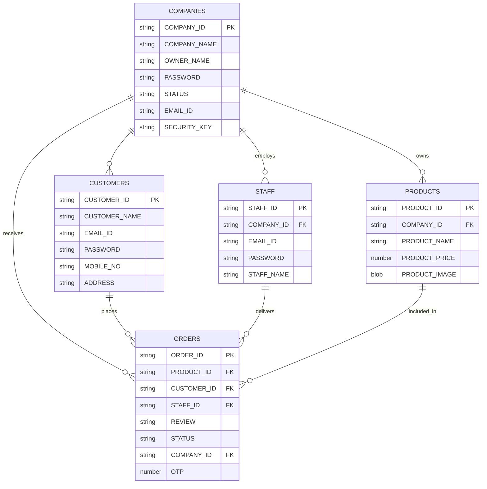

# ok-tummy-app

OK-Tummy! GUI App  
[Demo Link / Drive Resource](https://drive.google.com/file/d/1MzpfMvoUhb238OOV7vby5eFmBq7IELvR/view?usp=sharing)

---

## Overview

OK-Tummy! is a GUI-based food ordering and delivery management application. The system supports multiple roles (**Customer**, **Staff/Delivery**, **Company/Owner**) and implements workflows for placing orders, managing deliveries, staff management, and reviews.

---

## Features

### Customer Workflow
- Register/login
- Browse products
- Place orders or add items to cart
- View order history and add reviews

### Staff/Delivery Workflow
- Login/validation
- View assigned orders
- Mark orders as delivered
- View delivery history

### Owner/Company Workflow
- Staff management (add/view staff)
- View all orders for the company
- Assign staff for deliveries

### Other Features
- Random staff assignment for orders
- Order OTP for delivery validation
- Integration with Spoonacular API for product/recipe data

---

## Tech Stack

- **Backend:** Java (JDBC, SQL)
- **Frontend:** Java Swing GUI
- **Database:** Oracle
- **External APIs:** Spoonacular API (for recipes/products)
- **Libraries:**
  - Unirest (HTTP client for API calls)
  - org.json (JSON parsing)
  - javax.swing (UI)
  - java.sql (Database interaction)

---

## ER Diagram

<!-- Place your ER diagram here using Mermaid or image if needed -->

---

## Directory Structure

Below is the updated directory structure of the project, matching the actual source packages and files:

<details>
<summary>Textual Directory Structure (expand to view)</summary>

```
Source Packages/
│
├── yumxpress.dao/
│   ├── CompanyDAO.java
│   ├── CustomerDAO.java
│   ├── OrderDAO.java
│   ├── ProductDAO.java
│   └── StaffDAO.java
│
├── yumxpress.dbutil/
│   └── DBConnection.java
│
├── yumxpress.gui/
│   ├── AddDeliveryStaffFrame.java
│   ├── AddFoodFrame.java
│   ├── CancelOrderFrame.java
│   ├── CustomerAccountFrame.java
│   ├── CustomerCartFrame.java
│   ├── CustomerLoginFrame.java
│   ├── CustomerOptionsFrame.java
│   ├── CustomerRegistrationFrame.java
│   ├── DeliveryStaffLoginFrame.java
│   ├── DeliveryStaffOptionsFrame.java
│   ├── OrderFoodFrame.java
│   ├── OrderHistoryFrame.java
│   ├── OrderListFrame.java
│   ├── OrderProductFrame.java
│   ├── OrderProductFromCartFrame.java
│   ├── SellerLoginFrame.java
│   ├── SellerOptionsFrame.java
│   ├── SellerRegistrationFrame.java
│   ├── SplashScreenFrame.java
│   ├── UserVerifyFrame.java
│   ├── ViewDeliveryStaffFrame.java
│   ├── ViewFoodFrame.java
│   ├── ViewOrderHistoryFrame.java
│   └── ViewOrdersFrame.java
│
├── yumxpress.images/
│   └── ... (image resources)
│
├── yumxpress.pojo/
│   ├── CartPojo.java
│   ├── CompanyPojo.java
│   ├── CustomerPojo.java
│   ├── OrderPojo.java
│   ├── PlaceOrderPojo.java
│   ├── ProductPojo.java
│   └── StaffPojo.java
│
└── yumxpress.util/
    ├── Mailer.java
    ├── OwnerProfile.java
    ├── PasswordEncryption.java
    ├── SpoonacularAPI.java
    ├── UserProfile.java
    └── Validator.java
```
</details>

---

## 🚀 Application Workflow & Stakeholder Features

OK-Tummy supports three main stakeholders: **Seller**, **Customer**, and **Delivery Staff** (Staff & Delivery Staff modules are unified).

---

### 👨‍🍳 Seller (Company Owner)
- **Authentication:** Login with Company Name & Password
- **Food Management:** Add new food items (with image/description via Spoonacular API), view all added food items
- **Staff Management:** Add new staff (enter name, email, password; auto-generate Staff ID), view all staff (see details & IDs)
- **Order Management:** View all orders from customers, view orders assigned to each staff member (staff-wise order count)
- **Account Management:** Logout, delete company account (removes all associated data)

---

### 🛒 Customer
- **Authentication:** Register (name, email, password, mobile no, address) / Login
- **Profile & Cart:** View & update account details, manage cart (add/remove items)
- **Ordering:** Browse menu (add to cart or place direct order), place order (triggers OTP and email confirmation with order details & bill), cancel order (before delivery confirmation)
- **Order History & Review:** View all past orders, submit reviews after delivery

---

### 🚚 Delivery Staff (Staff & Delivery Staff Unified)
- **Authentication:** Login using staff email and password (assigned by Seller)
- **Order Fulfillment:** View assigned/pending orders, track and update order status, OTP verification on delivery (mark order as delivered only after OTP confirmation)
- **Order Tracking:** See history of delivered orders

---

### 🔁 Post-Delivery Feedback Loop

- **Customer:** Can submit a review for delivered orders
- **Seller:** Sees all orders and customer reviews in order history
- **Delivery Staff:** Delivered orders are moved to history (removed from pending list)

---

## 🗺️ System Interactions Map

| Actor          | Functionalities                                                        |
| -------------- | ---------------------------------------------------------------------- |
| **Seller**     | Login, Add/View Food, Add/View Staff, View Orders, Delete Account      |
| **Customer**   | Register/Login, Browse Menu, Cart, Order Food, Cancel, Review, History |
| **Delivery Staff** | Login, View Assigned Orders, Update Status, OTP Verify, Delivery History |

---

This workflow ensures:
- Seamless experience for all stakeholders
- Secure order fulfillment with OTP delivery
- End-to-end review and feedback loop
- Robust management for sellers and delivery staff

---

## Key Classes and Files

- `yumxpress.dao`: Data access for all entities (OrderDAO, StaffDAO, etc.)
- `yumxpress.pojo`: Data models (OrderPojo, StaffPojo, etc.)
- `yumxpress.gui`: Java Swing GUI screens for different user activities
- `yumxpress.util`: Utilities (DB connection, profile management, encryption, API integration)
- `yumxpress.images`: Image resources

---

*For more details, see the code and the Drive resource linked above.*
